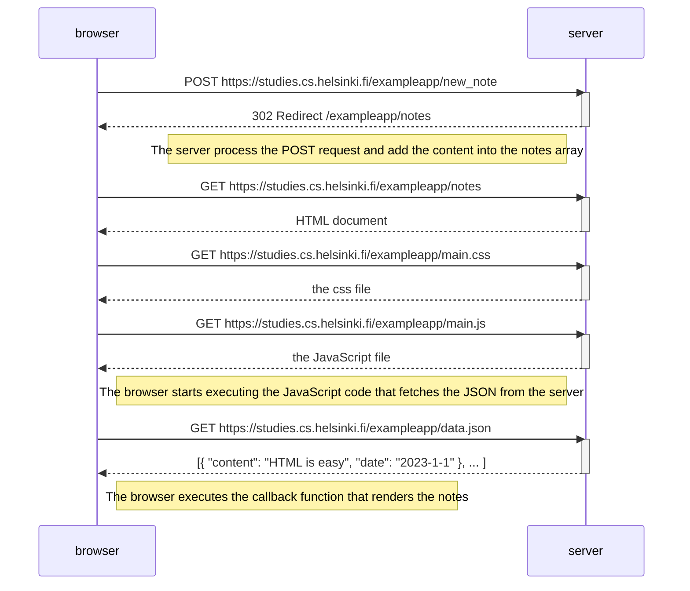
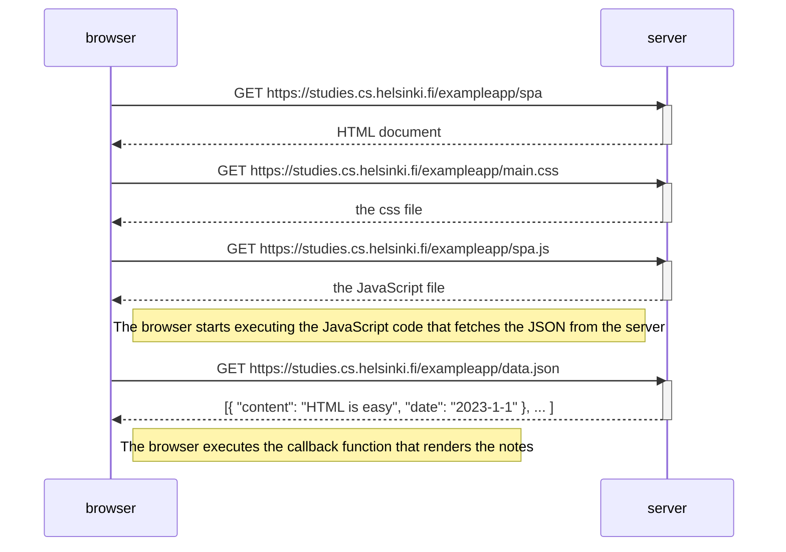
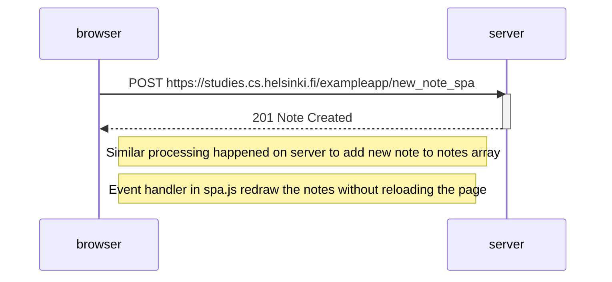

# Exercises

## Exercise 0.4: New note diagram

## Exercise 0.5: Single page app diagram

Our diagram looks the same as the traditional version of the webpage.

## Exercise 0.6: Single page app new note diagram

